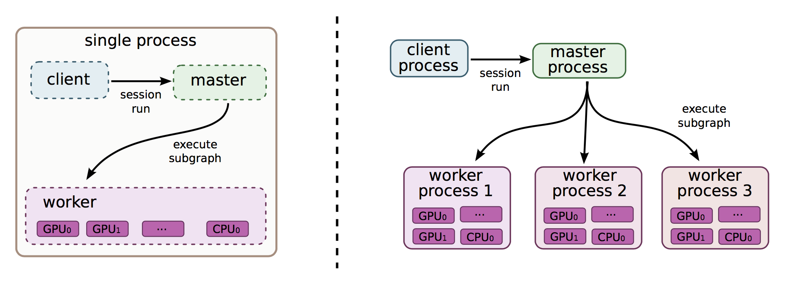
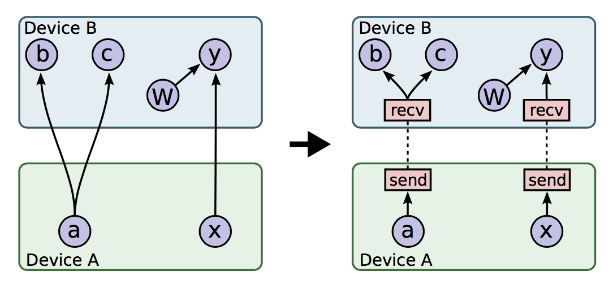
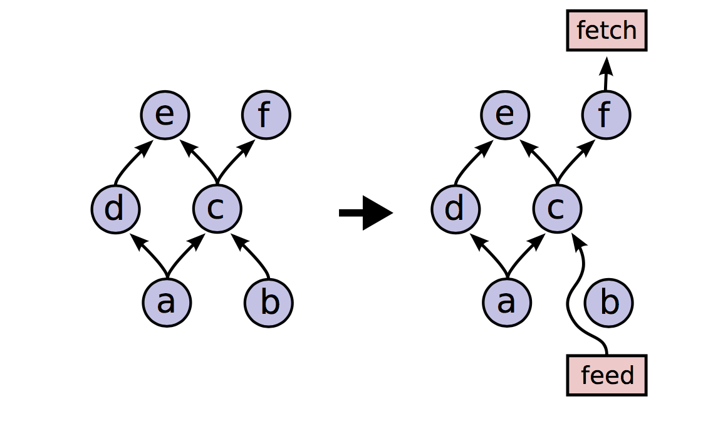

tensorflow

基于内部第一代机器学习系统 DistBelief 的第二代机器学习系统。 与 Borg 和 k8s
类似。

定位: 通用场景，通用设备, 通用平台的大规模的机器学习系统

### TensorFlow 的特点

* 通用平台 : PC(Linux, Windows), 手机(ios, android)，嵌入式设备等等
* 通用目的(general-purpose)的设备 : 支持多种设备，CPU，GPU，TPU
* 特定目的(special-purpose)的加速 : 对  GPU, CPU 单独优化
* 提供高级编程接口允许用户自定义的代码运行在各种系统

### 核心设计原则

#### 细粒度的操作流图

tensorflow 用 node 表示单独的数学操作(Add, MatMul) 使得用户用高级脚本
语言接口(high-level script interface)构建新的层

#### 延迟执行

1. 用符号数据流图表达模型， 输入数据到 placeholder，variable 用于保存状态
2. 在可用的设备上执行优化后的模拟
通过将执行延迟到整个模型已经定义好，可以更好地优化执行

#### 对异构加速器进行通用抽象

不同的设备用同一抽象，同一操作可以在多个设备之间切换，用户写相同的代码，
可以 CPU，GPU，TPU 上执行，使得相同的程序可以更加需要在不同的设备上进行切换。

### 模型

基于状态数据流图(stateful dataflow graph)的方式的模型

#### graph

包含一个或多个 node，所有的 node 组成一个有向无环图

#### operation

1. 对计算的抽象表达(比如加，减，点乘)，
2. 包含名字(name), 属性(attribute)等

m(>=0) 个 tensor 作为输入，n(>=0) 个 tensor 作为输出

属性的其中一个左右就是让不同类型 tensor 的 operation 多态化，
比如 你可以对 Add 这个操作，通过属性指定不同的类型，那么，它
就能支持不同类型的加法

tensorflow/core/ops/ops.pbtxt 包含了所有 operation 的定义

* Element-wise mathematical operations :Add, Sub, Mul, Div, Exp, Log, Greater, Less, Equal, ...
* Array operations : Concat, Slice, Split, Constant, Rank, Shape, Shuffle, ...
* Matrix operations : MatMul, MatrixInverse, MatrixDeterminant, ...
* Stateful operations : Variable, Assign, AssignAdd, ...
* Neural-net building blocks : SoftMax, Sigmoid, ReLU, Convolution2D, MaxPool, ...
* Checkpointing operations :  Save, Restore
* Queue and synchronization operations : Enqueue, Dequeue, MutexAcquire, MutexRelease, ...
* Control flow operations : Merge, Switch, Enter, Leave, NextIteration

#### kernel

对 operation  在特定设备设的实现，比如加法，在  GPU 和  CPU
上实现方法肯定不一样，所以需要两个 kernel 来实现。

既然同一操作有多个实现，那怎么确定用那个呢？

通过注册的方式，同一  operation 有多个  kernel 实现，每个
kernel 都需要注册到系统中并且有一个默认的优先级 顺序，
在没有指定的情况下，就按 属性依次选，比如 Add 这个操作，
有 GPU 和 CPU 两种实现，GPU 的优先级高，假设你的系统有 GPU
那么就优先在 GPU 上执行，如果你的系统每个有  GPU 就在 CPU
上执行

### node

对一个 operation 的实例化

input:0 或多个输入
output : 0 或多个输出

在指行的过程中，所有待执行都保存到一个准备队列中，由一个计数器控制 node 的执行，
当一个 node 的一个依赖满足， 计数器就减一， 当所有依赖都满足的时候，计数器
就为 0，该 node 就会加入准备队列，等待被执行。当一个  node 执行完毕，所有依赖
该  node 的节点的计数器就减一

一个 node 的操作可以分配给多个设备执行，设备之间通过 grpc 通信

#### edge

normal edge :

control dependencies: 特殊的 node, 没有数据流动. 但是只有 control dependencies 的源节点执行完之后，
control dependencies 的目标节点才开始执行，表达了一种 happend-before 关系。主要用来控制顺序和控制内存使用

#### tensor

在 graph 中流动的值，可以是带有类型的多维数组，支持绝大多数类型(int32,float32
等等）。在构建图的时候指定类型

tensor 在  device 中分配，并通过引用计数来管理

参考 cpp/tensor.md

#### variable

由于一个图可能被执行多次(比如 BP 算法），而很多大部分  tensor 都是临时的，对于哪些在
多次计算都选用保留，就用 variable 表示，这样这个 tensor 就可以在整个
过程中都存在，而 variable 是可以修改的。最典型的就是模型中权重，在 BP
中每次迭代中都更新。

#### sesssion

图已经构建好了，如何运行呢？tensoflow 利用 session 构建 一个 C/S 架构，
client 通过 session 连接到 master，然后将构建的图让 master 执行，这与我们
常用的网站的架构基本一致。session 与 http 中的  session 也很相似。

client 与  master 通过 grpc 通信

session 包含
* run : 让服务端运行一个 graph
* partial_run : 让服务端运行一个 graph 的一部分
* extend : 修改已有的 graph

每次执行的时候并不是 graph 的所有节点都执行，tensorflow 会
根据输出计算途中哪些 node 需要参与计算，之后才开始执行。

更多参考 cpp/session.md

#### device

每个 worker 负责一个或多个 device，每个 device 有 name 和 type，

每个设备的职责
1. 设备内存的分配与释放
2. 执行 kernel 的请求

设备的名称有两种方式

full name

`/job:<name>/replica:<id>/task:<id>/device:CPU:<id>`
`/job:<name>/replica:<id>/task:<id>/device:GPU:<id>`

legacy name
`/job:<name>/replica:<id>/task:<id>/CPU:<id>`
`/job:<name>/replica:<id>/task:<id>/GPU:<id>`

/job:localhost/device:cpu:0
/job:worker/task:17/device:gpu:3

设备的类型包括 CPU，GPU，TPU 等任意可以实现设备接口的 设备都可以纳入
tensorflow 的管理之下。 并且设备也是通过注册的方式加入系统

更多参考 cpp/device.md

#### cost model

在执行 graph 执行，系统需要预估执行时间，执行时间的预估分为静态
和动态，静态根据 operation 的类型，通信时间等进行估计，动态根据
以往执行情况预估

### 运行时

当 client 将一个 graph 通过 session 提交给 master 之后，master

1. 根据输出计算输出的依赖构造一个 graph，
2. 对 graph 进行优化(如子表达式消除，常量展开，死代码消除)
3. 根据 cost model，给 graph 中的每一个 node 找一个 device 来执行，据此构建一个执行图(subgraph)
4. 缓存整个图，将各个子图分配各个  worker
5. 各个 worker 执行将 kernel 分配给各个设备
6. 开始执行，

#### 单设备执行 : 单机单设备
#### 多设备执行 : 单机多设备
#### 分布式执行 : 多机多设备

### 错误冗余

通过以下两种方式发现错误

1. 通过健康检查
2. 通过执行错误

当发生错误的时候，整个 graph 的执行被中断。重新开始运行

variable 通过指定迭代次数或时间写入 save node
当失败需要重新执行的时候，同 restore node 通过 checkpoint 来恢复

### 集群

同步模式 : n 个任务执行完成才继续下一步
异步模式 : n 个任务各自执行
备份模式 : n 个中有 m 个执行成功就继续

tensorflow 包含 local 和 distributed 两种实现，前者主要限定在单机内，
通过进程间通信或者 grpc 通信；后者是可以跨主机的，通过 grpc 通信。

整个 tensorflow 是一个 C/S 架构，服务端最主要的就是 master，当配置集群的时候
还有 worker 进程，每个 worker 控制一组设备，由 master 来控制每个 worker
执行什么，master 与  worker 之间通过  grpc 通信。

问题:

一个 node 的  operation 只能在一个设备上执行么？

一个 graph 被分割成多个子图，每个子图在一个设备上执行，
subgraph 之间如果要跨设备计算，那么会在设备之间，插入
Send 和  Receive 节点代理子图之间的执行依赖

### 其他

#### partial 执行

当只要执行一个 graph 的一部分的时候，tensorflow 有 partial_run 支持该操作。
基本实现原理就是，根据输出和输入计算子图，再执行。其中会把输入替换为 feed node，
在输出之后增加  fetch node。参考下图

#### 控制流

因为通过长期实践表明 如果给  graph 支持控制流可以更加有效和有效地表达机器算法

如 Merge, Switch, Enter, Leave, NextIteration

#### input

对于输入，如果简单的用户直接在运行的时候提供，但是对于复杂的情况，比如读一个
几百 G 的图片数据集，需要系统每次主动从一个存储系统或文件中读取，而不需要，客户端
显示地发送给系统，这样，带来两个好处
1. 缩短了路径: 由原来的数据源，客户端，计算模型三步变为数据源，计算模型两步
2. 提高的读取效率: 由于 tensorflow 直接从存储读取，避免了数据的拷贝

#### 队列

在两个析构组件之间进行数据传递，通过队列缓存可以提高系统的吞吐量，这点适用于任何系统，
在机器学习中，最典型的就是，每次训练的时候，从队列批量取数据喂给计算模型。

此外，还提供了 shuffling 队列用于将输入的数据顺序打乱。

#### 容器(container)

容器用于管理长时间运行的可修改的状态(mutable state)，如
variable，其生命周期与进程的一样长。

#### 优化

* 子表达式消除
* 控制内存消耗和数据通信开销
* 异步 kernel
* 优化 kernel 库
* 有损压缩
* 数据并行 : 100 次迭代在一台机器和分十份每台执行 10 次效果是一样的么？
* 模型并行
* RDMA
* CPU-to-GPU : CUDA ; GPU-to-GPU : DMA

### TensorBoard

1. 可视化计算图
2. 统计变量变化过程
3. 性能跟踪

### 博采众长

借鉴了以下项目

* Theano : 单机上与  tensorflow 相当
* Torch : 由于没有使用 dataflow 在可移植性方面不如 tensorflow
* Caffe : 很难定义新层和优化
* Chainer
* DistBelief
* Project Adam
* Project Server
* Halide
* Dryad
* Flume
* Spark
* CIEL
* Naiad :
* SparkNet : 收敛太慢
* MXNet : 与 tensorflow 最相近，但是目前不允许一个值的 sparse gradient update，这点对于大模型的分布式的训练非常关键

### 更近一步

parameter server 的架构

无状态的 worker 进程进行计算
有状态的 parameter server 进程维护模型参数

用户将神经网络定义为 DAG，终结于 loss 函数

每个 worker 进程单独计算，之后将更新状态写入 parameter server 进程

由于参数状态可以更新使得其非常适合与大规模

目前的三个需要增强的地方

1. 定义新的层不方便：研究者不一定具备 C++ 语言能力， 实现新的层成为一个障碍
2. 调优训练算法 : 目前的接口不一定能满足
3. 定义新的训练算法 : 目前只支持固定的执行模式，对 RCNN, 增强学习模型与现有模型不一样

此外，包括将已经训练好的模型集成都已有服务，在移动设备上运行等等。DistBelief
都存在问题，因此需要一个新的系统来解决这个问题，因此  TensorFlow 应运而生。

### 执行模型

与批量数据流系统的不同点

* The model supports multiple concurrent executions on overlapping subgraphs of the overall graph.
* Individual vertices may have mutable state that can be shared between different executions of the graph.

worker task :
ps task :  用户可以用定义模型的脚本语言在 ps task 上编程
